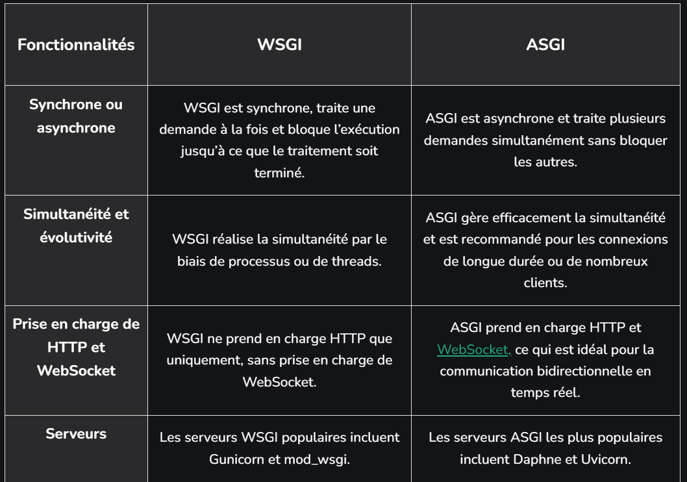
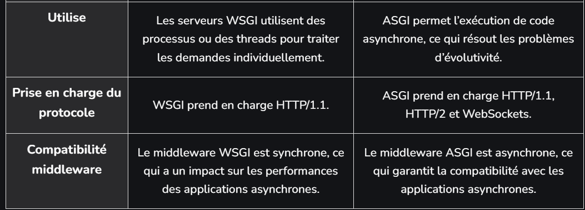
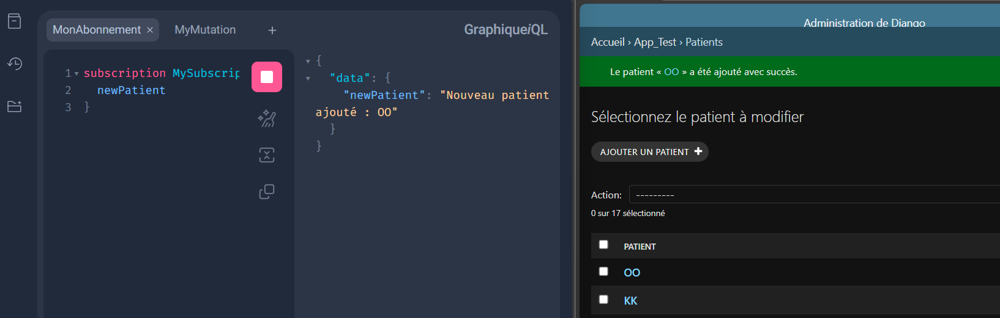

# GRAPHQL-SUBSCRIPTIONS-BACKEND

Ce backend utilise Django, Strawberry-GraphQL et Django-Channels pour implémenter une API GraphQL avec subscriptions, en exploitant les WebSockets pour des mises à jour en temps réel. 

## Bibliothèques nécessaires

Nous devons nous assurer d'installer les bibliothèques suivantes :

```bash
pip install django strawberry-graphql django-channels daphne
```

### Description des bibliothèques

Django : Framework principal pour la gestion des données et des vues.
Strawberry-GraphQL : Fournit un schéma GraphQL simple à configurer. <br />
Django-Channels : Ajoute la prise en charge d'ASGI pour des protocoles asynchrones comme les WebSockets.
Daphne : Serveur ASGI utilisé pour exécuter l'application.


## Configuration dans settings.py

Ajoutons ou modifions les configurations suivantes pour activer l'ASGI et les WebSockets :

```bash 
# Ajout des applications nécessaires
INSTALLED_APPS = [
    ...,
    'channels',              # Nécessaire pour la prise en charge ASGI
    'strawberry.django',     # Intégration de Strawberry avec Django
]

# Configuration des Channels pour ASGI
ASGI_APPLICATION = 'nom_du_projet.asgi.application'
# Dans notre cas le projet est nommer graphql_demo

# (si nécessaire)
CHANNEL_LAYERS = {
    "default": {
        "BACKEND": "channels.layers.InMemoryChannelLayer",
    },
}

```

## Création du fichier asgi.py

Ce fichier permet de définir la structure de l'application ASGI avec Django Channels :

voici un exemple de configuration en générale

```bash

import os
from django.core.asgi import get_asgi_application
from channels.routing import ProtocolTypeRouter, URLRouter
from channels.auth import AuthMiddlewareStack

os.environ.setdefault('DJANGO_SETTINGS_MODULE', 'nom_du_projet.settings')

application = ProtocolTypeRouter({
    "http": get_asgi_application(),  # Requêtes HTTP classiques
    "websocket": AuthMiddlewareStack(
        URLRouter(
            []  # Ajoutez vos routes WebSocket ici si nécessaire
        )
    ),
})

```

Pour la configuration AGSI de notre backend de ce projet, nous avons défini la structure de l'application ASGI comme suite:


```bash

graphql_app = GraphQL(schema)

application = ProtocolTypeRouter({
    "http": django_asgi_app,
    "websocket": AuthMiddlewareStack(
        URLRouter([
           
            path("graphql/", graphql_app),
        ])
    ),
})

```
Les WebSockets sont généralement utilisés pour implémenter les subscriptions.

Un WebSocket est un protocole de communication bidirectionnel qui permet une interaction en temps réel entre un client (comme un navigateur web) et un serveur.les WebSockets établissent une connexion persistante, permettant à l'un ou l'autre côté d'envoyer des données à tout moment.

### Structure de base d'un WebSocket :

Client : Établit une connexion avec un serveur via WebSocket. <br />
Serveur : Écoute les connexions entrantes et communique avec le client.

Dans notre cas comme nous utilisons GraphQL avec Django Channels, donc nous devons configurer asgi.py pour inclure un routeur WebSocket et nous allons utiliser le django admin comme client HTTP pour le teste Backend. Alors pas besoin d'un code coté client pour le test du backend car le serveur ecoutera l'adresse du django admin tout simplement. 


## Création du schéma GraphQL avec une subscription

Dans notre projet nous avons defini un schéma qui contient les query ainsi que un subsription pour le test du backend:

```bash

Category_maladie = django.apps.apps.get_model('app_test', 'Category_maladie')
Patient = django.apps.apps.get_model('app_test', 'Patient')


@strawberry.type
class Subscription:
    @strawberry.subscription
    async def new_patient(self) -> AsyncGenerator[str, None]:
        """
        Notifie en temps réel lorsqu'un nouveau patient est ajouté.
        """
        print("Un client s'est abonné à 'new_patient'")

        queue = asyncio.Queue()

        @receiver(post_save, sender=Patient)
        def patient_signal_handler(sender, instance, created, **kwargs):
            if created:
                # Placer le message dans la file d'attente en mode synchrone
                async_to_sync(queue.put)(f"Nouveau patient ajouté : {instance.name}")

       
        #try:
        while True:
            message = await queue.get()
            yield message


# Schéma et configuration GraphQL
schema = strawberry.Schema(query=Query, mutation=Mutation, subscription=Subscription)

graphql_app = GraphQL(schema, subscription_protocols=[GRAPHQL_TRANSPORT_WS_PROTOCOL])


```

Le code du subscription coté serveur  permet de notifier le client quand un patient est ajouter.


## Exécution de l'application avec Daphne

Daphne est un serveur ASGI qui permet de gérer les WebSockets et les requêtes asynchrones. Pour lancer le projet, j'ai utilisé la commande suivante :

```bash
daphne -b 0.0.0.0 -p 8000 nom_du_projet.asgi:application
```
Pour lancer le serveur Django avec le support des WebSockets et des subscriptions, Nous devons utiliser Daphne, car le serveur de développement Django classique (runserver) ne supporte pas les WebSockets.

Si Nous souhaitons continuer à utiliser python manage.py runserver pendant le développement, nous pouvons configurer daphne comme backend ASGI avec le fichier asgi.py:

En installant channels et en configurons le backend ASGI_APPLICATION dans settings.py

```bash
pip install channels

```
```bash
ASGI_APPLICATION = "graphql_demo.asgi.application"

```
mais cette méthode est moins robuste pour gérer les WebSockets comparée à Daphne.


## Pourquoi utiliser ASGI et Daphne ?

L’utilisation de ASGI (Asynchronous Server Gateway Interface) au lieu de WSGI (Web Server Gateway Interface) dépend principalement des besoins de votre application.

ASGI est conçu pour les applications modernes nécessitant des fonctionnalités comme :

WebSockets : Pour des communications bidirectionnelles en temps réel (ex. : messagerie instantanée, notifications en direct). <br />
Protocoles asynchrones : Pour traiter les requêtes sans bloquer le thread principal. et ien d'autre.

Si votre application nécessite des interactions en temps réel, il est necessaire d'utiliser ASGI car il permet de maintenir des connexions ouvertes (WebSockets) et d’envoyer des données en temps réel aux clients.

Daphne est un serveur ASGI  conçu pour gérer les connexions HTTP et WebSocket de manière asynchrone.
Il permet de lancer une application Django avec ASGI, assurant la compatibilité avec les WebSockets pour les subscriptions GraphQL.

ASGI et Daphne permettent de garantir une gestion optimale des requêtes asynchrones et des protocoles modernes.

## Quand utiliser WSGI ?
WSGI reste pertinent dans les cas suivants :

Applications simples :

Notre application est purement basée sur des requêtes HTTP classiques (REST API, sites web non interactifs).
Nous n’avons pas besoin de WebSockets ou de streaming de données en temps réel.





## Test des subscriptions

Voici un exemple sur le subscription coté backend avec GRAPHiQL. <br />
Un patient est ajouter et le message est envoyer immediatement.

